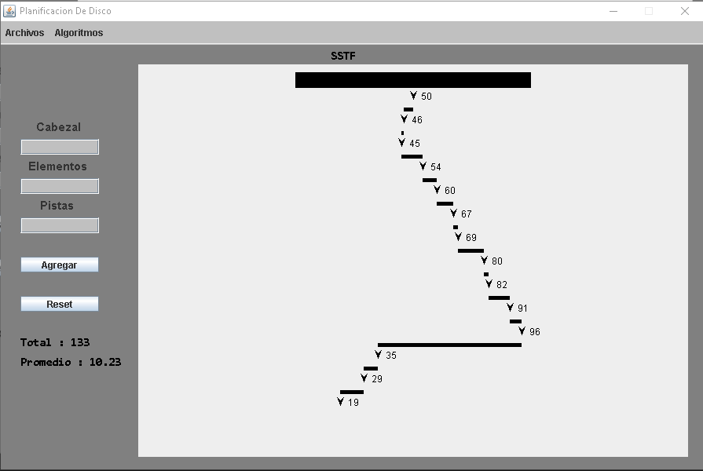

# Disk Scheduling Algorithms Project
This program implements several disk scheduling algorithms used in operating systems to optimize the order in which disk I/O requests are served. These algorithms aim to reduce seek time, minimize head movement, and improve overall system efficiency.

The program has a limit of 200 traks and 13 elements

### The algorithms included are

- First-Come, First-Served (FCFS)
- Shortest Seek Time First (SSTF)
- SCAN (Elevator Algorithm)
- C-SCAN (Circular SCAN)
- LOOK
- C-LOOK

### Interface 

***To start using the program, we can introduce the elements or open one of the files with the .pdd extension.***

### Algorithms Implemented

+ #### First-Come, First-Served (FCFS)

The FCFS algorithm processes disk I/O requests in the order they arrive.

+ #### Shortest Seek Time First (SSTF)

SSTF selects the request closest to the current head position, minimizing seek time at each step.

+ #### SCAN (Elevator Algorithm)

The SCAN algorithm moves the disk arm in one direction, servicing all requests until it reaches the end of the disk, then reverses direction.

+ #### C-SCAN (Circular SCAN)

C-SCAN moves the disk arm in one direction only. Once it reaches the end, it quickly returns to the beginning without servicing requests during the return.

+ #### LOOK

LOOK works like SCAN but stops moving in one direction once the last request in that direction is served (instead of going all the way to the disk end).

+ #### C-LOOK

C-LOOK is a circular version of LOOK. The head moves only as far as the last request in one direction, then jumps back to the beginning without going to the disk end.

